# Image workshop

Velkommen til AlgPip's konkurrent til Photoshop!

I denne workshopen skal vi implementere forskjellige bildebehandlingsalgoritmer.


# Oppsett

```
npm install
npm run dev
```

Åpne http://localhost:9966/ i nettleseren. Når du gjør endringer i koden vil browseren
refreshe.

## Koden

I `src/effects/`-mappa ligger filene til de forskjellige effektene. En effekt får typisk inn bildet det skal jobbes på, og eventuelt noen parametre.
Så itererer man over pikslene i bildet og lager et nytt bilde som man returnerer.

APIet er ikke så stort, det består bare av funksjoner for å lese eller skrive verdier til et bilde.

```javascript
// Lage et nytt bilde:
var newImage = Image.empty(width, height); // Lager et blankt bilde med en viss størrelse
var newImage2 = Image.clone(image); // Kopi av et annet bilde

// Lese ut størrelser
var width = image.width;
var height = image.height;

// Lese ut verdier
// venstre topp er (0, 0). y=0 er altså øverste rad, y=1 neste rad osv.
var red = image.getR(x, y); // Få rødkomponenten av fargen på piksel x,y
var green = image.getG(x, y);
var blue = image.getB(x, y);

// Setter verdier/farger tilsvarende
// Fra og med 0 til og med 255
newImage.setR(x, y, 255);
newImage.setG(x, y, 0);
newImage.setB(x, y, 128);

// Kan evt sette alle i ett
newImage.setRGB(x, y, [255, 0, 128]);
```

En typisk effekt ser ut som noe ala det her:

```javascript
function effect(image) {
    // Lag et nytt bilde av samme størrelse
    const newImage = Image.empty(image.width, image.height);

    // Iterer over hver pixel, rad for rad (merk vi itererer over y ytterst)
    for (let y = 0; y < image.height; y++) {
        for (let x = 0; x < image.width; x++) {

            // Les ut aktuelle verdier fra originalbildet
            var r = image.getR(x, y);
            // ...
            
            // Regn ut nye verdier
            var nyR = r + 25;
            // ...

            // Sett verdi i det nye bildet
            newImage.setR(x, y, [nyR, nyG, nyB]);
        }
    }
    return newImage;
}


```

# Oppgaver

Anbefaler at man starter med Greyscale for å få en følelse av hvordan ting fungerer,
deretter er det bare å plukke det man synes virker mest spennende! Merk at vanskelighetsgraden
varierer mellom de forskjellige.

Kan se fasit (/få hjelp) ved å sjekke ut branchen `solution`, evt klikke [her](https://github.com/Matsemann/image-workshop/tree/solution/src/effects)

[Greyscale](#Greyscale) (liten)  
[Threshold](#Threshold) (liten)  
[Invert](#Invert) (liten)  
[Warmfilter](#Warmfilter) (liten)  
[Blur](#Boxblur) (middels)  
[Median filter](#Median-filter) (middels)  
[Sharpen](#Sharpen) (liten, men avhengig av èn av de to foregående)  
[Histogram equalization](#Histogram-equalization) (middels)  
[Seam carving](#Seam-carving) (stor)


## Greyscale

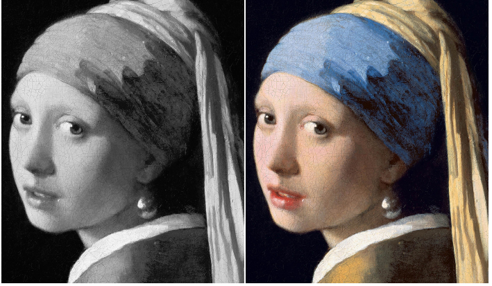

Ofte kalt svart/hvitt, men vi har jo mange "shades of grey". For hver piksel, regner man ut "intensiteten"
den har, basert på R,G,B verdiene. Det letteste er bare å ta snittet av RGB-verdiene på en piksel i originalbildet og sette
pikselen i det nye bildet til den verdien. Men for å et greyscale som bedre tilsvarer det et menneskeøye opplever intensiteten er,
kan man heller bruke formelen `intensity = 0.34 * r + 0.5 * g + 0.16 * b`.

Endre på fila `src/effects/greyscale.js`. Gjør tilsvarende som i eksempelet over:
Iterer over alle pikslene i bildet. Les ut verdiene fra originalbildet og beregn intensitetsverdien/gråverdien
pikselen skal ha og sett den i det nye bildet. For å sette verdien som grå, setter man RGB til samme verdi. F. eks. om man
regnet ut at intensiteten skal være 203, setter man både R, G og B til 203.


## Threshold

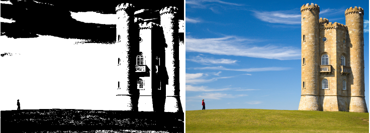

Den egentlige "svart/hvitt". Ligner veldig på greyscale, men i stedet for å sette RGB til intensiteten,
setter man enten fargen til svart (0,0,0) eller hvitt (255,255,255) basert på om intensiteten er over en viss grense/threshold.

Endre på fila `src/effects/threshold.js`. I tillegg til bildet effekten skal legges på, får du inn grenseverdien for om hver piksel skal bli hvit eller svart.

## Invert

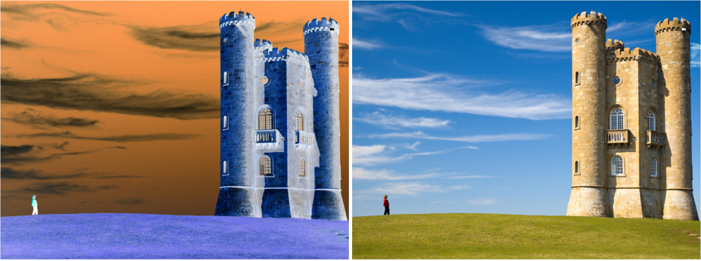

Rett og slett invertering av fargene, 255 - c, der c er intensiteten per pixel per farge. Brukes hyppig i flashes i skrekkfilmer.

Endre på fila `src/effects/invert.js`.

## Warmfilter

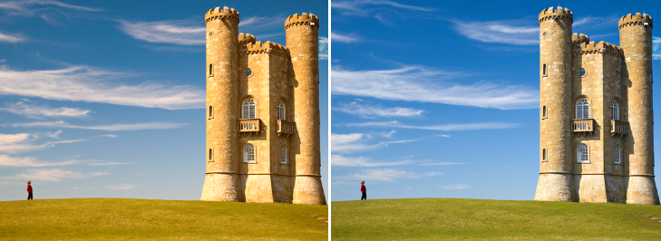

Gjør bildet varmere ved å legge til litt rød og trekke fra litt blå. Endre på fila `src/effects/warmfilter.js`. 
Lag et nytt blankt bilde på størrelse med bildet du får inn, og iterer over alle pikslene. For hver piksel,
les ut RGB verdiene fra bildet du fikk inn. Men i stedet for å kopiere verdiene direkte over til det nye bildet, legger du til litt (f eks +25)  på rødverdien,
og trekker til litt på blåverdien (feks -25).

## Boxblur

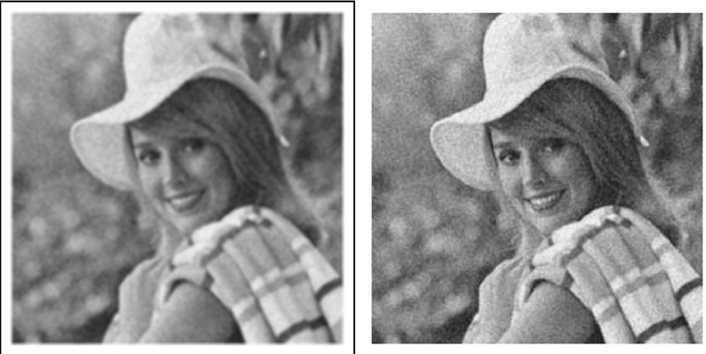

Dette er gode gamle blur som mange har minner fra i photoshop. Det finnes mange måter å implementere blur på, men vi har
valgt det aller enkleste tilfellet, nemlig å sette hver pixel til å være gjennomsnittet av pixlene rundt. Vi sier ofte
at vi beregner verdien basert på et *omegn* av hver verdi. Denne måten å behandle bilder på kalles *spatial filtering*,
og box blur er et såkalt *lavpassfilter**. I vår implemetasjon sender man med hvor stor radius rundt hver pixel som skal
være beregningsgrunnlaget. Dvs. at sender vi med 1, så er omegnet et 3x3-grid, sender vi med 2, er omegnet et 5x5-grid. 

Endre på fila `src/effects/boxblur.js`. Iterer over alle pikslene, og for hver piksel må du finne pikslene i en radius rundt og summere opp RGB-verdiene for å regne ut snittet for hver farge.
Sett deretter fargen på pikselen til å være disse snittene av RGB. For å iterere over alle naboene, kan du bruke en dobbel for-løkke, der man går `(fra x-radius til og med x+radius)` og tilsvarende for y.

## Median filter

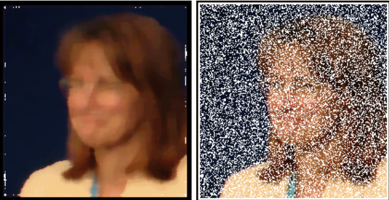

Medianfilteret er en veldig god støyreduserer, og har veldig lik implementasjon som blur, bare at man setter hver pixel
til å være medianen av omegnet i stedet for gjennomsnittet.

Endre på fila `src/effects/medianfilter.js`. Gjør som for boxblur, men i stedet for å finne snittet putter du alle verdiene i en liste, sorterer den og plukker ut den
midterste verdien og bruker den som verdi på pikselen du ser på.

## Sharpen

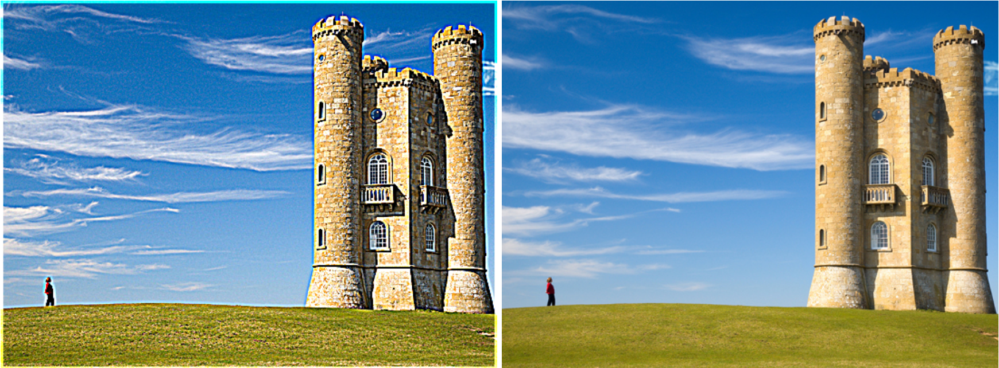

Krever at man har implementert enten blur eller medianfilter (eller et annet lavpassfilter!).

En enkel sharpen-funksjon er å ta differansen mellom et bilde og den lavpassfiltrerte versjonen av bildet, for så å
legge til differansen på orignalbildet igjen.

`diff = originalbilde - lavpass(originalbilde)`,  
`sharpened_originalbilde = orignalbilde + diff`.

Hvorfor fungerer dette? Når vi trekker et utjevnet bilde fra originalen, står vi igjen med høye verdier i de pixlene som
har blitt utjevnet mye, altså de pixlene som skiller seg ut fra nabopixlene. Når vi så legger dette på originalbildet igjen, 
vil de homogene områdene forbli de samme (fordi differansen er ~0 der), mens vi får utslag der det er kanter e.l. 

Endre på fila `src/effects/sharpen.js`.

## Histogram equalization

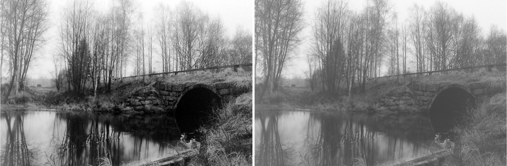

Histogram equalization dreier seg om å utjevne spekteret av intensitetsverdier man bruker i et bilde. Enklere forklart,
dersom man har et bilde som er lite kontrastfylt, f. eks et veldig lyst bilde, så gir man bildet mer kontrast.

Det som skjer er at vi for hver pixel og farge gjør en mapping til en ny verdi. Lang historie kort, formelen er på
følgende format. Hver intensitetsverdi `k` skal mappes til verdien `ny_k` (0 til 255). `ny_k` er på
formen (se bildet):

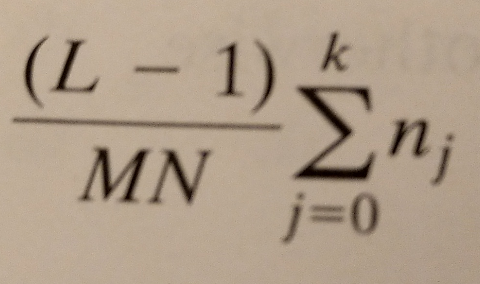

Der `L-1 = 255`, `MN = image.height*image.width` og `n_j`er antallet pixler i bildet som har intensitetsverdi `j` (mellom 0 og `k`). 

Endre på fila `src/effects/histogramequalization.js`.

**Eksempel**

La oss si vi har et bilde som er `3x3`, der rødverdiene er `5, 4, 4, 5, 3, 1, 0, 4, 1`.
Vi teller antall av hver verdi `k` og får linjen `nr` i tabellen under.  
Deretter summerer vi hvor mange verdier som er til og med hver `k`. F. eks. er `sr[4] = 7`, fordi det er summen av `nr[0]+nr[1]+nr[2]+nr[3]+nr[4]`.  
Så regner vi `ny_kr` for hver `k`, altså verdien den skal mappes til. For bårt 3x3 bilde blir det da `(255 / (3*3)) * sr[k]`, rundet til hele tall.  
Når det er gjort itererer vi over alle pikslene i vårt originale bilde, og bytter ut verdiene i henhold til tabellen. F. eks. skal alle `4` bli byttet med `198`, da får vi spredd
verdiene utover hele spekteret og får bedre kontrast.

||||||||||
|---|---|---|---|---|---|---|---|---|
|**k**|**0**|**1**|**2**|**3**|**4**|**5**|**6**|...|
|**nr**|1|2|0|1|3|2|0|...|
|**sr**|1|3|3|4|7|9|9|...|
|**ny_kr**|28|85|85|113|198|255|255|...

## Seam carving

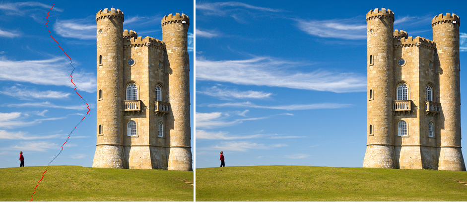

Når man skalerer bilder ned i én akse, får man et problem med at ting blir skvist/strukket ut av sine egentlige proposjoner.
Seam carving løser dette ved at i stedet for å skalere ned hele bildet jevnt, finner man heller de 
uviktige delene av bildet og forkaster dette.

Algoritmen består av 3 deler:
1. Finn energien til hver piksel, altså hvor viktig den er i bildet
2. Beregn forskjellige stier fra topp til bunn og regn ut deres totale energi
3. Fjern pikslene i den stien som var minst viktig (hadde lavest energi)

Dette gjøres om og om igjen til bildet har den bredden man ønsker.

I `src/effects/seamcarving.js` skal du implementere del 1 og 2. Del 3 er ikke så spennende og mest knot, så det får du av oss.

**imageEnergy(..)**  
Bildet vi skal returnere skal ikke ha RGB, men bare én verdi per piksel, så i stedet for å lage et nytt bilde kan vi heller lage et
energyimage i riktig størrelse, ala `var energyImage = Image.createEnergyImage(image.width, image.height);`.
Et energyimage er det samme som et vanlig image, men kan bare ha én verdi per piksel. Den kan vi sette ved å gjøre `energyImage.setValue(x, y, 1000);`.

Vi må beregne energinivået til hver piksel. For å beregne det for en piksel, ser vi på pikslene rundt.
For piksel `(x, y)`, er det pikselen over `(x, y-1)`, under `(x, y+1)`, venstre `(x-1, y)` og til høyre `(x+1, y)` vi må se på.
Vi regner ut differansen i rød, grønn og blå mellom pikselen til høyre og den til venstre, aka 
```
diffRx = (rHøyre - rVenstre)^2
diffGx = (gHøyre - gVenstre)^2
diffBx = (bHøyre - bVenstre)^2
```
I kode ville det tilsvart `diffRx = Math.pow(image.getR(x+1, y) - image.getR(x-1, y), 2)`. Deretter gjør man det samme, men for pikselen under minus den over.
Når man har gjort det summerer man sammen alle 6 verdiene og tar roten av dem, ala `Math.sqrt(diffRx + diffGx + diffBx + diffRy + diffGy + diffBy)`.

**Eksempel**  
Om det var litt forvirrende, har vi heldigvis et eksempel her. Vi skal beregne energien til pikselen i midten.

| | | |
|---|---|---|
|(0,0,0)|(180,190,50)|(0,0,0)|
|(100,101,75)|(55,55,55)|(255,125,50)|
|(0,0,0)|(199,200,10)|(0,0,0)|

```
diffRx = (255 - 100)^2 = 24025
diffGx = (125 - 101)^2 = 576
diffBx = (50 - 75)^2 = 625
diffRy = (199 - 180)^2 = 361
diffGy = (200 - 190)^2 = 100
diffBy = (10 - 50)^2 = 1600
energi = sqrt(24025 + 576 + 625 + 361 + 100 + 1600) = 165.18
```

Piksler som ligger på kanten vil ikke dette fungere på, så du kan bruke `isBorderPixel(..)` funksjonen for å sjekke dette, og da heller sette
energien for den pikselen til en fast verdi. `300` f. eks.

**calculateSeams(..)**

Her bruker vi dynamisk programmering for å finne den veien fra topp til bunn av bildet som har minst energi.
Vi får inn energibildet vi akkurat regnet ut, og skal nå summere verdiene nedover for å beregne totalenergien for de forskjellige veiene man kan velge.

En path/vei er sammenhengende, og kan enten komme fra pikselen rett over, den skrått oppover til venstre, eller den skrått oppover til høyre.

**Eksempel**:  
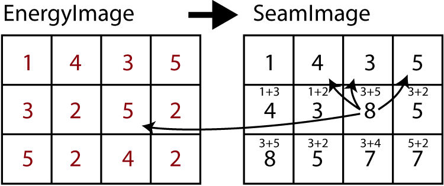

Verdiene i EnergyImage til venstre er de vi beregnet i forrige steg, og får som input til vår funksjon. Etter at funksjonen vår har kjørt,
skal vi returnere et nytt bilde med verdier tilsvarende det i høyre bilde. Algoritmen er som følger:
For første rad, kopier over verdiene som energibildet hadde. For de andre radene, finner vi billigste path til den pikselen vi ser på ovenifra, og legger til verdien til pikselen fra energibildet.
For eksempel om vi ser på ruten med pilene: For den pikselen ser vi på de 3 pikslene ovenfor. Av 4, 3 og 5 er 3 lavest. Så ser vi på energibildet, der har den pikselen verdien 5. Vi summerer da 3 og 5 og får verdien 8.
Vi gjør dette for alle piksler på rad to, før vi så gjør det samme for rad 3. Da finner vi den laveste av de over på rad 2.
Merk at på kanten har vi bare to over oss. F. eks. nederst i venstre hjørne er det det laveste av 4 og 3, plusset på 5, som blir verdien.

Algoritmen er litt forenklet for hver piksel (man må ta hensyn til om man er på kanten):
```javascript
seamValue = Math.min(
    energyImage.getValue(x-1, y-1),
    energyImage.getValue(x, y-1),
    energyImage.getValue(x+1, y-1)
)
seamImage.setValue(x, y, seamValue);
```
Dette gjøres da først for alle pikslene på en rad, så raden under osv.


(* Lavpassfilter er et type filter som jevner ut forskjeller. Motsetningen er høypassfilter, som fremhever forskjeller. 
Både blur og median filter er lavpassfiltre. Et filter som beregner den andrederiverte er et eksempel på et høypassfilter.)


